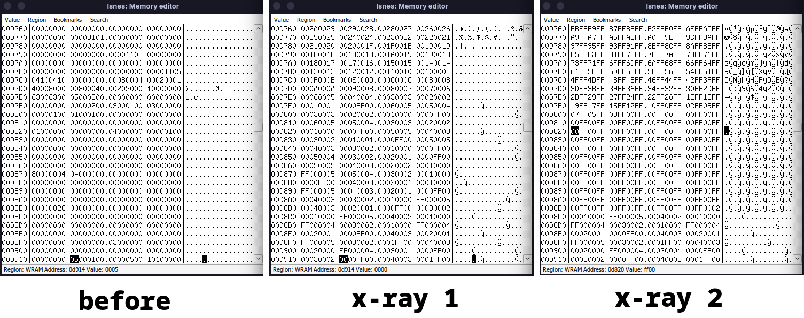

=== 0% Glitched, route by sniq and antimatterhorse === 

* 0% Landing Site

Firstly, we start the run in the same way as [[/anyg.org][Any% glitched]]

After getting X-ray and entering Landing Site OOB, we set flags to watch the Intro and Escape and set a Gold block to remove items. Movement and setups are optimized for consistency and completion, there are many ways to improve RTA timing. There are other route possibilities too, such as going for another Doorskip->Shuffler after X-ray, or creating more Gold blocks in a single Shuffler visit. 

As we explain the route below, please follow along [[https://youtu.be/1z3tL2sQDvc][this video]]

** Seeting the Intro and Escape flags
We navigate down 2 copies of Landing Site as usual. Normalized movement is done to reach a specific pixel. The first X-ray is used to set $D914 = 0000, which sets the Intro to be watched after reloading. We move the X-ray up until the screen is blue (after a purple) so we can see Samus on screen a bit. This is playing safe, as the flag is set correctly before that. 

A second X-ray is used a bit higher on screen, as to not interfere with $D914. We move X-ray up until the screen is in the edge between white and orange, then do two taps downwards (if X-ray is not brought down a little, some memory value will make the game crash after a few seconds). This X-ray position meets this conditions:

- Escape flag: yes (to finisht the game)
- Ceres Ridley: alive (otherwise we get softlocked at Ceres)
- All Doors: open (we don't have Power Bombs, and we need to open a pb door to reach a Save Station)

 shows how the memory values look before the 2 X-rays, and how it looks after both X-rays. It is probably possible to accomplish these things with a single X-ray, that would save time.

[[https://youtu.be/oVRr094mMmI][demo1]]

** Gold block to remove Major items

After that, we fall 4 copies of the room (count +1 when Samus morphs to go through the 1-tile tunnel). After counting to 4, we still fall the "big fall", jump over the mound to the left, but now we move left instead of right. We are gonna land on another mound, we move left to fall from it, and now we are on a flat surface above the blocks that lead to Gauntlet. 

We need to break the bottom block to have space to maneuver later, we use Screw attack for that. We now fall on the ground and go left to press against a step. We do a turn-jump-turn then activate X-ray. Scroll it all the way down, turn right, then tap up until Samus stops blinking, this will set two of those bombable blocks' BTS to 5D, so we have 2 Gold blocks near Gauntlet entrance. 

We go back up to those blocks, some of the solid blocks are now not-solid so we can go left and press against the "wall". We do 3 jump-turn-jump (careful not to do the last jump too high, else Samus might interact with the Gold block preemptively), then do a bomb-unmorph-turn to touch the Gold block when $0380 = 8950. That value will make a X-ray textbox appear (even if it is difficult to see because of the glitched graphics) that will make Samus collect 0 Major items, in other words, it will remove all Major items from Samus. Funilly enough, it doesn't interfere with "equipped items", only "collected items", so Samus can still use all the Major items she had previously equipped. (in the Pause menu, you can see that items aren't there anymore, so if you unequipped some items before, make sure to re-equip them before touching the Gold block). A vertical teleport will happen after the Item textbox disappears. 
 

[[https://youtu.be/VcUh9MF1zE8][demo2]]

** Tube exit

We *have* to transition to the Crateria Tube room: we need to reach a Save Station to save, but because Zebes is exploding, if we transition to Parlor or Crateria PB we get stuck (and Gauntlet is very slow). 

After the teleport, we go up and try to avoid the 03 transition blocks (Crateria PB). We move to a particular step slope and moonwalk against that step while holding Jump and both Angles. When Shoot is released, Samus will moonfall but quickly land in place. In this position, we crouch and X-ray all the way down until Samus starts blinking. That will set a transition to the Tube. 

That transition block is not visible, but it can be interacted with in the X=0 vertical line (this line is the one where Samus sinks in sometimes and is very bugged, it can interact with blocks that are far away, for example). We have to make sure to touch the transition block from the left side, as touching it from above, below, or right side will transition Samus inside solid blocks. 

We run off the slope going right, do a running jump against the wall then Space jump right to land on a piece of ground. The movement done now is just to make the transition touch easier, but faster methods can be done. Also, if you stood on top of an elevator transition block, find the time to Pause-unpause to remove the elevator softlock state. We hug the wall to the right then do a normalized spin jump to the left (we pause-unpause here). Hold both Angles and Left, then do a full jump to go across the X=0 vertical line, then immediatelly hold Right to touch the transition from its left side. 

Once in the Tube, just head to the Red Tower Save station (the Wrecked Ship save was a bit slower in our tests), save-rest-reload to get the Intro.

[[https://youtu.be/1bEL9Xx03U8][demo3]]

** Ceres with items

The Intro is used just to remove Missiles, the last 1%. Minutes could be saved by finding another way to remove Missiles, such as using another Gold block in Landint Site or even during Parlor OOB. 

Just a couple of tips here. 

- Deplete Samus's energy to make Ridley fly away, the fast way to do it is to hold Angle then do a small spin jump into Ridley's tail over and over again (Screw attack resets i-frames)
- As Ridley flies towards the screen, right before it pushes Samus to the left, tap X-ray then hold Right to have this "push" constantly happening. As long as we can avoid bonking a wall or a door, we can run faster going left because this "push" adds to Samus's movement in that direction. 
